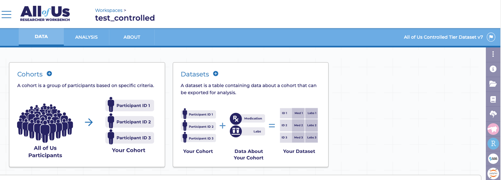
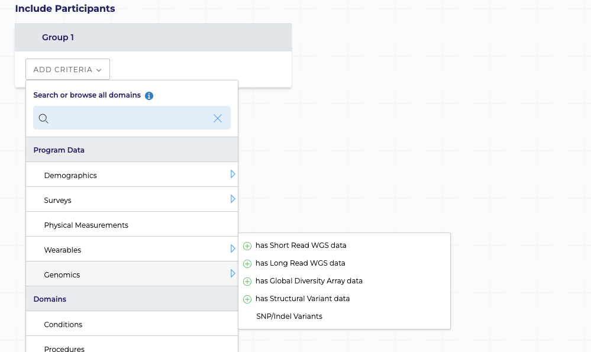
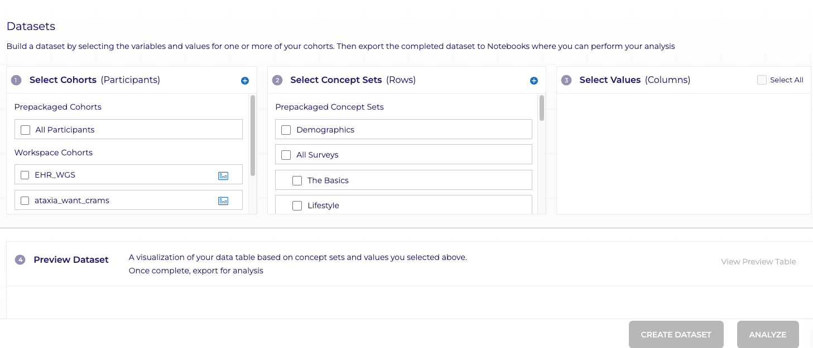
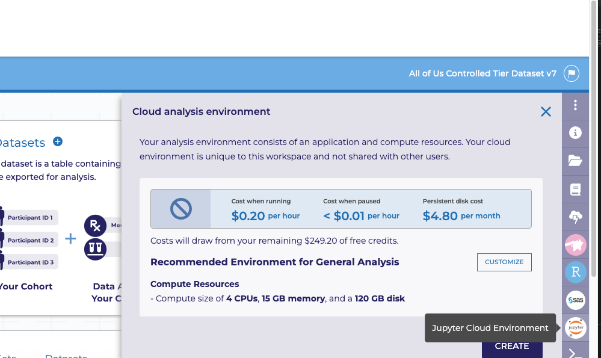

# all_of_us_str_pipeline
This is pipeline for studying STR data on the All of us (AOU) research platform.
It will use ExpansionHunter version 5 to assess repeats at speficified loci on CRAM files.
You will need to setup a google account to access AOU. If you already have one- it may be necessary to set one up exclusively for the AOU access.
When applying- apply for tier 7 or higher access.
## Step 1 cohort selection

When you have setup your account and signed in- you'll see a page like this.
You will need to set up a cohort by clicking "+ cohort".

Once you've created a cohort with all desired characteristics- you'll then need to create a dataset from said cohort:

This can be done while selecting with the cohorts you've created and annotated with the data you most desire.
When a dataset is created it will then be analysable in a custom named python notebook (.ipynb file)
## Step 2 starting interactive session
To access and analyse the data via the python notebook environment, you'll first need to click the jupyter environment icon.

## Step 3 STR analysis

## Step 4 analysis

